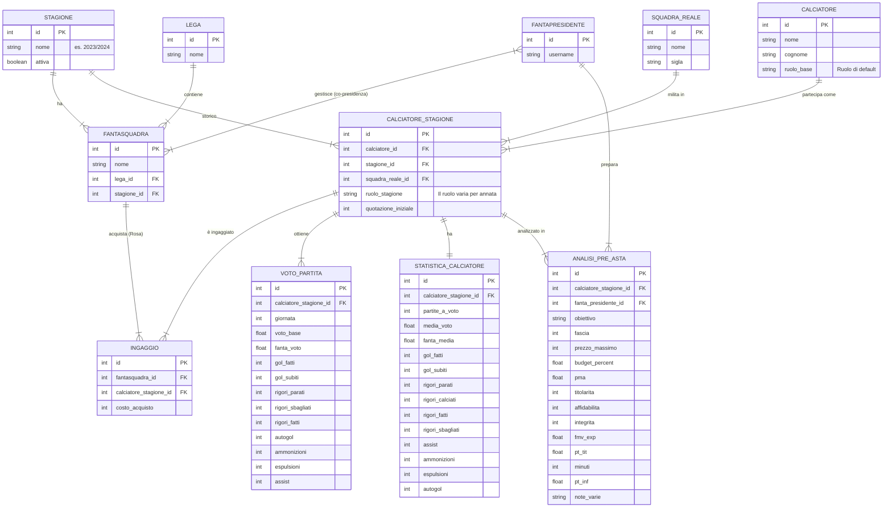

# Progetto Piattaforma Fantacalcio: Architettura e Modelli Dati

Questo documento illustra l'architettura dati e le scelte progettuali per la piattaforma web Django destinata alla gestione di un torneo privato di fantacalcio multi-annata.

## 1. Schema ER

Lo schema Entity-Relationship è stato aggiornato per:
- Esplicitare la granularità completa delle statistiche avanzate dai CSV (voti di giornata e totali annui).
- Supportare chiaramente il **cambio ruolo** del calciatore tra un'annata e l'altra (gestito tramite `CALCIATORE_STAGIONE`).
- Includere la scheda **Analisi Pre-Asta**, essenziale per incrociare i dati e pianificare il draft.



## 2. Struttura delle App Django Consigliata

Aggiungiamo una nuova area dedicata alla strategia (`strategy`) per separare la preparazione dell'asta dal motore del torneo in corso:
1. **`core`**: Configurazioni e modelli base (`Stagione`, `SquadraReale`).
2. **`users`**: Gestione custom dell'utente (`FantaPresidente`).
3. **`players`**: Anagrafica (`Calciatore`) e storicizzazione del ruolo e quotazioni base (`CalciatoreStagione`).
4. **`fantacalcio`**: Logica di gioco (`Lega`, `FantaSquadra`, `Ingaggio`).
5. **`stats`**: Statistiche di giornata e stagionali, perfettamente aderenti al file Excel.
6. **`strategy`**: Modulo per le schede di analisi pre-campionato personale.

---

## 3. Modelli Django (`models.py`)

Di seguito i modelli aggiornati per riflettere i campi esatti estratti dai tuoi Excel e CSV.

### `players/models.py`
```python
from django.db import models
from core.models import Stagione, SquadraReale

class Calciatore(models.Model):
    RUOLI = [('P', 'Portiere'), ('D', 'Difensore'), ('C', 'Centrocampista'), ('A', 'Attaccante')]
    nome = models.CharField(max_length=100)
    cognome = models.CharField(max_length=100)
    ruolo_base = models.CharField(max_length=1, choices=RUOLI, help_text="Ruolo di default, può essere sovrascritto nella stagione")

    class Meta:
        verbose_name_plural = "Calciatori"
        unique_together = ('nome', 'cognome') 

class CalciatoreStagione(models.Model):
    """Lega un calciatore a una specifica stagione, permettendo il cambio di ruolo nel tempo"""
    calciatore = models.ForeignKey(Calciatore, on_delete=models.CASCADE, related_name='stagioni')
    stagione = models.ForeignKey(Stagione, on_delete=models.CASCADE, related_name='calciatori')
    squadra_reale = models.ForeignKey(SquadraReale, on_delete=models.CASCADE, related_name='roster')
    
    # IL RUOLO QUI PERMETTE IL CAMBIO DA UN'ANNATA ALL'ALTRA
    ruolo_stagione = models.CharField(max_length=1, choices=Calciatore.RUOLI)
    quotazione_iniziale = models.PositiveIntegerField(default=1)

    class Meta:
        verbose_name_plural = "Calciatori per Stagione"
        unique_together = ('calciatore', 'stagione')
```

### `stats/models.py`
Aggiornato con tutte le colonne dei file Excel per i voti di giornata e i totali annui.
```python
from django.db import models
from players.models import CalciatoreStagione

class VotoPartita(models.Model):
    calciatore_stagione = models.ForeignKey(CalciatoreStagione, on_delete=models.CASCADE, related_name='voti')
    giornata = models.PositiveIntegerField()
    voto_base = models.DecimalField('Voto', max_digits=4, decimal_places=2, null=True, blank=True)
    fanta_voto = models.DecimalField(max_digits=4, decimal_places=2, null=True, blank=True) # Calcolabile o importabile
    
    # Eventi estratti dal CSV Giornata
    gol_fatti = models.PositiveIntegerField('Gf', default=0)
    gol_subiti = models.PositiveIntegerField('Gs', default=0)
    rigori_parati = models.PositiveIntegerField('Rp', default=0)
    rigori_sbagliati = models.PositiveIntegerField('Rs', default=0)
    rigori_fatti = models.PositiveIntegerField('Rf', default=0)
    autogol = models.PositiveIntegerField('Au', default=0)
    ammonizioni = models.PositiveIntegerField('Amm', default=0)
    espulsioni = models.PositiveIntegerField('Esp', default=0)
    assist = models.PositiveIntegerField('Ass', default=0)

    class Meta:
        verbose_name_plural = "Voti Partita"
        unique_together = ('calciatore_stagione', 'giornata')

class StatisticaCalciatore(models.Model):
    calciatore_stagione = models.OneToOneField(CalciatoreStagione, on_delete=models.CASCADE, related_name='statistiche_riassuntive')
    
    # Dati estratti dal CSV Statistiche Globali
    partite_a_voto = models.PositiveIntegerField('Pv', default=0)
    media_voto = models.DecimalField('Mv', max_digits=4, decimal_places=2, default=0.0)
    fanta_media = models.DecimalField('Fm', max_digits=4, decimal_places=2, default=0.0)
    
    gol_fatti = models.PositiveIntegerField('Gf', default=0)
    gol_subiti = models.PositiveIntegerField('Gs', default=0)
    rigori_parati = models.PositiveIntegerField('Rp', default=0)
    rigori_calciati = models.PositiveIntegerField('Rc', default=0)
    rigori_fatti = models.PositiveIntegerField('R+', default=0)
    rigori_sbagliati = models.PositiveIntegerField('R-', default=0)
    assist = models.PositiveIntegerField('Ass', default=0)
    ammonizioni = models.PositiveIntegerField('Amm', default=0)
    espulsioni = models.PositiveIntegerField('Esp', default=0)
    autogol = models.PositiveIntegerField('Au', default=0)
```

### `strategy/models.py` (NUOVA APP)
Modello dedicato all'analisi pre-campionato. Ogni utente (`FantaPresidente`) potrà caricare le sue valutazioni per incrociarle poi con le statistiche reali (`StatisticaCalciatore`).
```python
from django.db import models
from django.conf import settings
from players.models import CalciatoreStagione

class AnalisiPreAsta(models.Model):
    calciatore_stagione = models.ForeignKey(CalciatoreStagione, on_delete=models.CASCADE, related_name='analisi_pre_asta')
    utente = models.ForeignKey(settings.AUTH_USER_MODEL, on_delete=models.CASCADE, related_name='strategie_asta')
    
    # Campi Tattici ed Economici
    obiettivo = models.CharField('Obiett.', max_length=50, blank=True)
    fascia = models.PositiveIntegerField('Fascia', null=True, blank=True)
    prezzo_massimo = models.PositiveIntegerField('Prezzo', default=0)
    budget_percentuale = models.DecimalField('Budget %', max_digits=5, decimal_places=2, help_text="Su base budget 350", null=True, blank=True)
    pma = models.DecimalField('PMA', max_digits=6, decimal_places=2, null=True, blank=True, help_text="Prezzo Medio Altre Leghe")
    quotazione = models.PositiveIntegerField('Quo', default=0) # Quotazione sistema
    
    # Valutazioni qualitative
    titolarita = models.PositiveIntegerField('Titolarità', null=True, blank=True)
    affidabilita = models.PositiveIntegerField('Affidabilità', null=True, blank=True)
    integrita = models.PositiveIntegerField('Integrità', null=True, blank=True)
    
    # Testi e Note
    commento = models.TextField('Commento', blank=True)
    nota_1 = models.CharField('Nota 1', max_length=255, blank=True)
    nota_2 = models.CharField('Nota 2', max_length=255, blank=True)
    nota_3 = models.CharField('Nota 3', max_length=255, blank=True)
    nota_4 = models.CharField('Nota 4', max_length=255, blank=True)
    nota_5 = models.CharField('Nota 5', max_length=255, blank=True)
    
    # Dati Predittivi / Modelli attesi (oltre alle classiche MV/FMV storiche)
    fmv_exp = models.DecimalField('FMV Exp.', max_digits=4, decimal_places=2, null=True, blank=True)
    pt_tit = models.DecimalField('Pt. Tit.', max_digits=5, decimal_places=2, null=True, blank=True)
    minuti = models.PositiveIntegerField('Minuti', null=True, blank=True)
    pt_inf = models.DecimalField('Pt. Inf.', max_digits=5, decimal_places=2, null=True, blank=True)
    
    class Meta:
        verbose_name_plural = "Analisi Pre-Asta"
        unique_together = ('calciatore_stagione', 'utente')

    def __str__(self):
        return f"Strategia {self.utente.username} - {self.calciatore_stagione.calciatore.cognome}"
```

---

## 4. Acquisizione e Import dei Dati (Automazione API)

L'architettura supporta pienamente la duplice modalità di ingestione dei dati:
1. **Upload Manuale**: Caricamento via interfaccia (Admin o View custom) di file Excel/CSV preesistenti.
2. **Automazione API/Scraping**: Acquisizione diretta e parsing via script HTTP autenticati.

### Automazione del Download e Parsing
Basandoci sui tuoi script Python per l'acquisizione, possiamo integrare nativamente in Django questi *scraper* tramite i _Management Commands_ (es. `python manage.py import_from_api`), oppure usando task periodici (es. _Celery_).

In questo modo il sistema mantiene una **Sessione HTTP Autenticata**, recupera l'Excel in binario, e subito dopo richiama il parser dati per popolare l'ORM:

> [!TIP]
> **Consiglio per l'Integrazione in Django:**
> Crea un file `services/api_fanta.py` dove incapsuli la logica di `BeautifulSoup` e `requests`.
> Quando richiami `get_voti()`, una volta salvato il file `voti.xlsx` localmente, la funzione invoca il tuo parser `search_player_voto()` adattato per scrivere i dati nel nuovo DB relazionale usando un `bulk_create` / `bulk_update` sul modello `VotoPartita`.

```python
# Esempio di logica integrata in Django (simile ai tuoi script)
from bs4 import BeautifulSoup
import requests
# ... import dei tuoi modelli Django (es. VotoPartita)

def get_voti_and_import():
    day = get_last_matchday() 
    session = login_in_fanta()
    year = datetime.now().year
    url_get = f"{URL_API}Excel/votes/{year}/{day}"
    response = session.get(url_get, stream=True)
    
    if response.status_code == 200:
        file_path = f"{DOWNLOAD_FOLDER}voti_g{day}.xlsx"
        
        # 1. Download del file
        with open(file_path, "wb") as f:
            for chunk in response.iter_content(chunk_size=8192):
                f.write(chunk)
                
        # 2. Scrittura automatica in DB usando i Modelli Django
        # search_player_voto leggerà l'Excel e creerà le istanze di VotoPartita
        importa_voti_nel_db(file_path, day)
        return True
    return False
```

**Flussi di Automazione Consigliati da Mantenere:**
1. **Quotazioni (Listone):** Metodo `get_prices()`, scarica e aggiorna/crea le istanze di `CalciatoreStagione`.
2. **Voti di Giornata:** Metodo `get_voti()`, richiamato ogni martedì, scarica e popola i `VotoPartita`.
3. **Statistiche Globali (Nuovo Script):** Dovrai creare una funzione simile alle altre (es. `get_stats()`) che punta all'endpoint delle statistiche globali, scarica l'Excel e aggiorna massivamente il modello `StatisticaCalciatore`.
4. **Analisi Pre-Asta:** Questa scheda (che contiene le tue note personali) di norma rimarrà caricata manualmente (Upload) usando `update_or_create` così che tu possa raffinare le valutazioni nel tempo senza duplicazioni.
```
